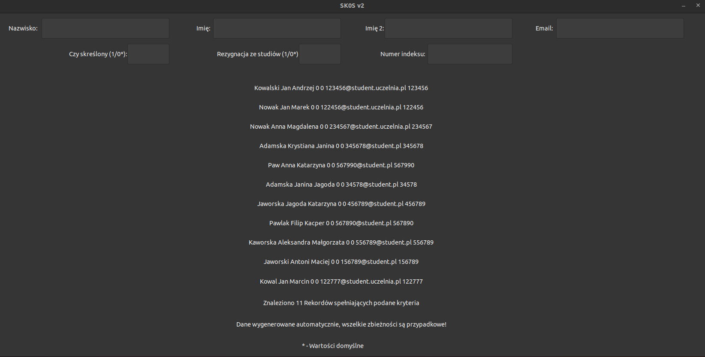

# SK0Sv2
Student Information Application for PP2 AGH UST


## Aim
The purpose of this assignment is to create a simple application that uses an external library (gtk) and applies the knowledge and skills learned in the PP2 course.


## Dataset
In the repository there is included file data.csv
which contai


## Building from source
Requirements:`gtk` linked into `g++`
```
cmake .                                # Compiles
./cmake-build-debug/SK0Sv2             # Runs 
```

## Dataset
The file `data.csv` contains a sample set of data.

In order to use your own dataset replace file `data.csv` with your data.

The data format is compatible with the data format on `USOS`.

## Architecture
Project is written in C++. Uses GTK for the GUI and CMake as the build system.


## Author
Filip Gieracki, ISI AGH UST
